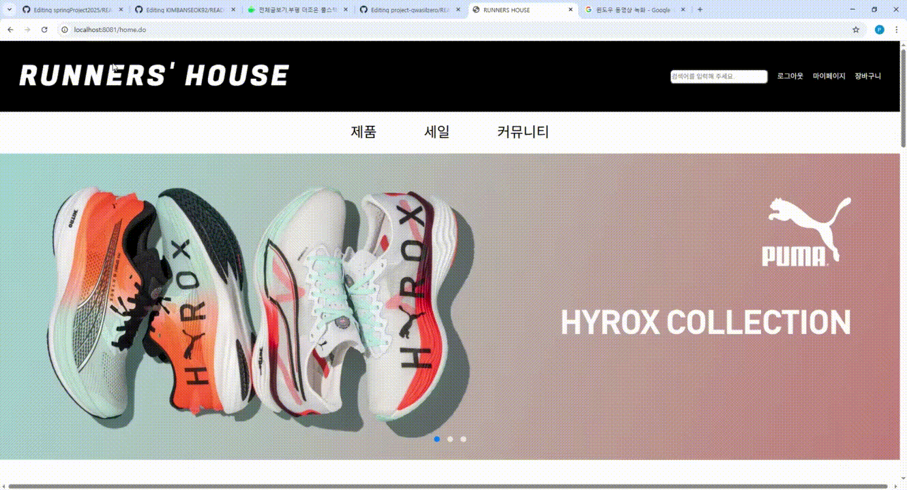

# 3team 프로젝트

  

# ⏳ 3team 개요
#### 🎠 프로젝트명 : RUNNERS' HOUSE
#### 🎐 프로젝트 목표: 러닝을 사랑하는 사람들을 위한 커뮤니티 & 쇼핑 플랫폼 구축
#### 🎃 팀명 : 3team 
#### 🕶 조원 : 정은성(팀장), 경환, 아린, 지훈, 반석

 

# ✨ 프로젝트 소개
**RUNNERS HOUSE**는 단순한 러닝 용품 쇼핑몰이 아닙니다.  
이곳은 러닝을 사랑하는 모든 사람들이 모여 **소통하고, 성장하며, 동기부여를 주고받는 공간**입니다.  

누구나 달릴 수 있지만, **함께 달릴 때 더 멀리 갈 수 있습니다.**  
RUNNERS HOUSE는 러너들이 자신의 이야기를 나누고, 제품을 구매하고,  
크루를 결성하며, 전문가의 조언을 들을 수 있는 진정한 **러너들의 집**을 목표로 합니다. 🏠👟 

 

# ⏳ 개발 기간
| 기간 | 주요 진행 내용 |
|------|----------------|
| **2025.10.23 ~ 2025.10.27** | 🧭 **프로젝트 기획 및 설계**   - 사이트 구조 기획 및 역할 분담   - Figma를 통한 페이지 플로우 및 디자인 시안 제작   - 구글 드라이브를 활용한 문서화 및 회의록 정리     |
| **2025.10.28 ~ 2025.11.02** | 💻 **기본 레이아웃 및 관리자(Admin) 페이지 개발**   - Spring Boot 기반 환경 세팅 및 폴더 구조 구성   - `/admin` 페이지 공통 헤더·푸터 및 로그인 레이아웃 구현 |
| **2025.11.03 ~ 2025.11.07** | 🛍️ **사용자(Home) 페이지 코딩 및 기능 구현**   - `/home` 주요 페이지 (메인, 상품, 커뮤니티 등) 제작   - 공통 CSS/JS 및 반응형 스타일 적용 |
| **2025.11.08 ~ 2025.11.09** | 🧩 **기능 통합 및 오류 점검**   - 관리자·사용자 페이지 연결 및 데이터 연동 테스트   - UI/UX 피드백 반영 및 개선 |
| 
**2025.11.10 (월)**
| 🚀 **최종 점검 및 배포 준비**   - 전체 페이지 최종 리뷰 및 기능 확인   - GitHub 업로드 및 README 최종 정리 |

🗓️ **총 개발 기간:** 2025년 10월 23일 ~ 11월 10일 (약 3주간)  

 

## 🖥️ **기술 스택**
| 구분 | 기술 |
|------|------|
| **Backend** |  |
| **Frontend** |      |
| **Database** |  |  |
| **Tools** |        |
| **Collaboration** |     |

 

## 🧠 **핵심 기능 소개**

### 🏡 **1. 사용자 페이지 (User Page)**
- **홈 화면:** 감각적인 Black & White 컨셉 디자인  
- **회원 관리:** 회원가입, 로그인, 정보 수정  
- **상품 탐색 및 구매:** 카테고리별 탐색, 장바구니, 주문·결제 기능  
- **마이페이지:** 주문 내역, 쿠폰, 리뷰, 적립금 관리  
- **커뮤니티:** 자유게시판, 러닝 크루 모집, 후기 공유  
- **채팅 기능:** 러너 간 1:1 또는 그룹 채팅  

### 👑 **2. 관리자 페이지 (Admin Page)**
- **매출 분석 대시보드:** 일/월/연 매출 현황, 인기 상품 시각화  
- **회원 관리 시스템:** 신규가입자 및 탈퇴자 모니터링  
- **재고 관리:** 품절 자동 처리, 재입고 계획, 재고 경고 시스템  
- **고객 문의 관리:** 문의 통합 관리 및 실시간 답변 등록  
- **커뮤니티 관리:** 신고 게시글 모니터링, 트렌드 키워드 분석  

 

## 💡 **팀원별 역할 분담**
| 팀원 | 역할분담 | 
|------|------------|
| 👨‍💼 **정은성(팀장)** | **/home/product** , **/admin/product** | 
| 🧑‍💻 **아린** |  **공통 CSS (Header/Footer)** , **/home/community · board · info · login/signup** |  
| 👟 **전경환** | **마이페이지 작성 및 수정** ,  **공통 CSS 확인 수정(Header/Footer)**  | 
| 🤖 **김지훈** | **/admin/inquiry · refund-return · orders · user-list** | 
| 🎨 **김반석** | **/admin/banner** , **/home/rally** ,  | 

 

## 🚀 **향후 개발 방향**

- **AI 기능 강화:** 개인별 맞춤 러닝 코스 및 상품 추천  
- **커뮤니티 고도화:** 게시판 & 크루 중심의 러너 네트워킹 강화  
- **UX 개선:** Figma 기반 피드백 반영 및 반응형 디자인 적용  
- **데이터 시각화:** 매출/러닝 통계 대시보드 추가  

---

 

## 🌐 **참고 사이트 (Inspiration)**
- [Runtalk.kr](https://runtalk.kr/)  
- [Runnerking.com](https://www.runnerking.com/)  
- [Trailrunners.kr](https://trailrunners.kr/?redirect=no)  
- [Runnerstation.co.kr](https://runnerstation.co.kr/)  

 

## 📂 프로젝트 자료 모음

| 분류 | 링크 |
|------|------|
| 📝 회의록 | [회의록 보기](https://docs.google.com/document/d/1IBMVSNfwdWseMDj5G-dgKjRZBsJ3Z7KgpZNmYsxiB68/edit?usp=sharing) |
| 🏗 설계 자료 | [설계 보기](https://drive.google.com/drive/folders/1WqbDMTMkynVD0cCp9hnwFD0ld0HBcUQW) |
| 📚 공통 문서 | [공통 문서 보기](https://drive.google.com/drive/folders/1Xm2uaNjuhy3Qlk6FlUh8F5hIuKT3p7nS) |

<h4> 🎆 파일 흐름 간단 구조</h4>
<pre>
home.jsp
	├─login.jsp
		├─idPwdSearch.jsp
	├─signup.jsp
		├─jusoPopup.jsp
	├─mypage
		├─information.jsp(mypage default screen)
			├─information-change.jsp
		├─my-inquiry.jsp
			├─my-inquiry-detail.jsp
		├─orders.jsp
		├─review.jsp
			├─review-view.jsp
			├─review-write.jsp
		├─refund-return.jsp
	├─community
		├─board.jsp(community default screen)
			├─board-edit.jsp
			├─board-post.jsp
			├─board-view.jsp
		├─rally-board.jsp
		├─crew.jsp
			├─crew-post.jsp
		├─chat.jsp
			├─chatroom-view.jsp
	├─product.jsp
		├─product-info.jsp
			├─productInquiry-add.jsp
	├─cart.jsp	
		├─paybefore.jsp
			├─payafter.jsp
	├─policy
		├─about.jsp
		├─privacy-policy.jsp
		├─terms.jsp
</pre>
<pre>
admin
	├─admin-main.jsp(admin default screen)
   	├─banner.jsp
   	├─inquiry.jsp
    	├─inquiry-view.jsp
   	├─refund-return.jsp
  	├─product.jsp
     	├─product-info.jsp
      	├─product-add.jsp
   	├─orders.jsp
   	├─board-report.jsp
      	├─board-report-view.jsp
   	├─user-list.jsp
      	├─user-list-view.jsp
</pre>

